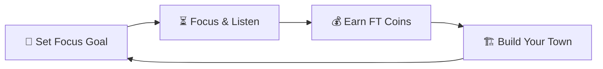

# 🏛️ Focustown: Build Your Focus, Grow Your Town

> **Where productivity builds communities. Turn your distraction-free deep-work sessions into a thriving cozy skyline.**

Focustown is a beautifully crafted, gamified Pomodoro timer built with Flutter. It takes the proven science of time-boxing and wraps it in a cozy town-building simulation. Every minute you spend focused is a minute spent gathering materials and earning resources to customize, construct, and grow your own virtual town.

---
Front.png
## 🌟 The Core Gameplay Loop

1. **Focus**: Choose your focus duration (from a quick 5-minute task to an intense 60-minute deep-work session).
2. **Earn**: Every single minute you successfully stay focused rewards you with **10 FT Coins**.
3. **Construct**: Use your hard-earned coins to purchase cozy homes, apartments, mansions, and grand towers.
4. **Expand**: Design your custom 8x8 grid city. Watch your productivity materialize from a vacant lot into a bustling urban haven.

---

## ✨ Outstanding Features

| Feature | Description | Key Highlight |
| :--- | :--- | :--- |
| **🎮 Gamified Pomodoro** | A sleek, circular countdown timer showing work and break phases with intuitive controls. | 10 coins per focused minute |
| **🌆 8x8 Town Grid** | Place and arrange buildings in real-time. Choose from standard houses, advanced villas, and towering skyscrapers. | Interactive visual growth |
| **🎵 Ambient Soundscapes** | Immerse yourself in built-in soothing soundscapes (Rain, running water, lo-fi beats, white noise). | Perfect audio environment |
| **📂 Local Custom Music Import** | Import your favorite local MP3, WAV, or AAC audio files directly from your device storage. | Unlimited sound personalization |
| **📊 Productivity Analytics** | Visual graphs showing weekly stats, session history, total focused hours, and building milestones. | Driven by `fl_chart` |
| **🧘 Distraction-Free Zen Mode** | Locks navigation tabs and dims the interface during work periods to eliminate micro-distractions. | Pure attention guarding |
| **🛡️ 100% Local & Secure** | No cloud servers, no accounts to create, and no telemetry. Your database sits safely on your device. | Absolute data privacy |

---

## 🎨 Premium Dark Aesthetics

Designed from the ground up for modern, distraction-free focus:
* **Background Color**: Sleek Onyx Deep Dark (`#0F0D13`)
* **Primary Accents**: Luxurious Amber Gold (`#E7C365`)
* **Typography**: Clean, high-legibility Google Fonts (Inter)
* **Micro-interactions**: Subtle haptic feedback and smooth animations during transitions.

---

## 💎 Focustown Premium

Unlock the ultimate productivity toolkit with a **$2.99 one-time purchase**. No recurring monthly fees!

* **📥 Unlimited Sound Import**: Bring in external ambient tracks, study soundscapes, or your favorite white noise mixes from your phone.
* **🕰️ Custom Duration Controller**: Tailor your work/break durations perfectly to your style beyond the standard limits.
* **🏰 Mega Building Collection**: Gain access to exclusive premium buildings, grand towers, and special architectures to make your town truly unique.
* **🔄 Purchase Restoration**: Easy single-tap restoration across all your active iOS/Android devices using native billing APIs.
